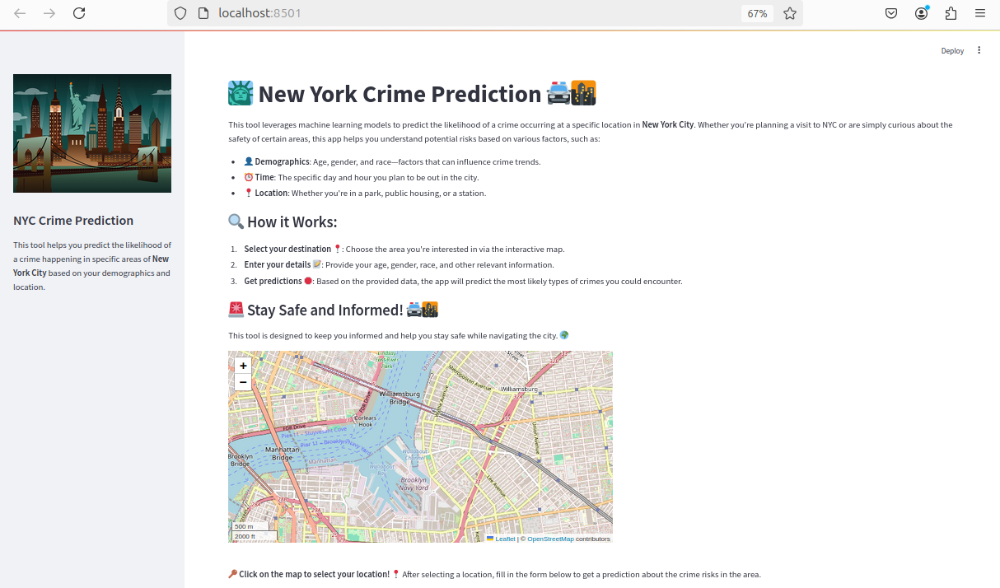
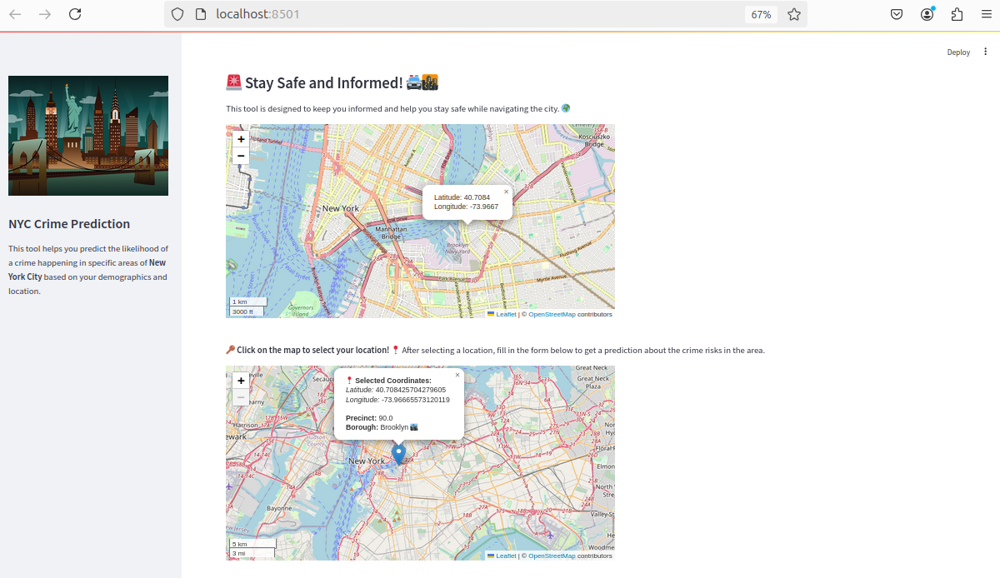
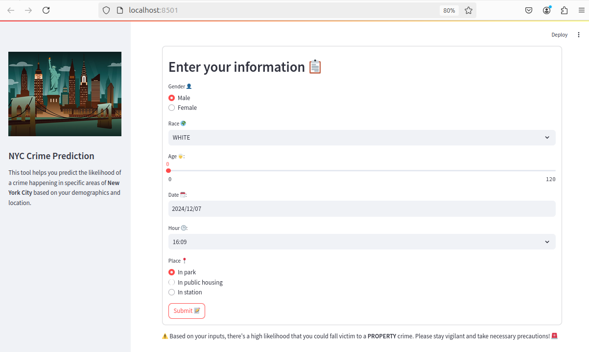

# 🗽 New York City Crimes Detection Using Machine Learning

  <h4>
    <a href="#overview">📋 Overview</a> |
    <a href="#dataset">📊 Dataset</a> |
    <a href="#notebooks">💻 Notebooks</a> |
    <a href="#technologies">🛠️ Technologies</a> |
    <a href="#user-interface">🖥️ User Interface</a> |
    <a href="#paper">📄 Paper</a>
  </h4>

---

## 📋 Overview

Predicting crime probabilities is crucial for enhancing public safety. This machine learning-based web application utilizes historical crime data from New York City to provide valuable insights into potential crime occurrences. By integrating user-specific details such as location and time, the application empowers users to make informed decisions and take preventive actions. Whether planning a route, selecting a residential area, or staying aware of potential risks, this tool offers a proactive approach to personal safety.

---

## 📊 Dataset

This project leverages the [NYPD Complaint Data Historic Dataset](https://data.cityofnewyork.us/). The dataset includes all valid felony, misdemeanor, and violation crimes reported to the New York City Police Department (NYPD) from 2006 to 2021. It contains:

- **6,901,167 complaints**  
- **35 columns** of data, including spatial and temporal information, crime descriptions, and penal classifications.

---

## 💻 Notebooks

The repository includes the following Jupyter notebooks:

- 🧹 [**Data Cleaning & Exploratory Data Analysis (EDA)**](research/EDA.ipynb)  
  Perform initial data cleaning and explore key patterns in the dataset.

- 🤖 [**Data Preparation & Modeling**](research/Modeling.ipynb)  
  Train and evaluate machine learning models for crime prediction.

---

## 🛠️ Technologies

### 🌐 Web Application:
- **Streamlit** - for building interactive dashboards  
- **Folium** - for map visualizations  
- **geopy** - for geocoding  
- **geopandas** - for spatial data manipulation  
- **shapely** - for geometric operations  
- **Docker** - for containerization and deployment  

### 📈 Data Cleaning, EDA, and Modeling:
- **Pandas** - data manipulation  
- **seaborn** - statistical visualization  
- **matplotlib** - data plotting  
- **Scikit-learn** - machine learning  
- **LightGBM** - gradient boosting  
- **XGBoost** - gradient boosting  
- **CatBoost** - categorical boosting  

---

## 🖥️ User Interface

Below are examples of the application's user interface:  

📍 **Interface**  

📈 **Map Visualization & Prediction Results**  

---

## 📄 Paper

Our research findings are documented in a paper included in this repository. You can view the paper [here](docs/paper.pdf).

---

## 🙌 Credits

This project was built by the team:

- **Nour Mabrouk**  
- **Bacem Ahmed**  
- **Anas Ben Amor**
